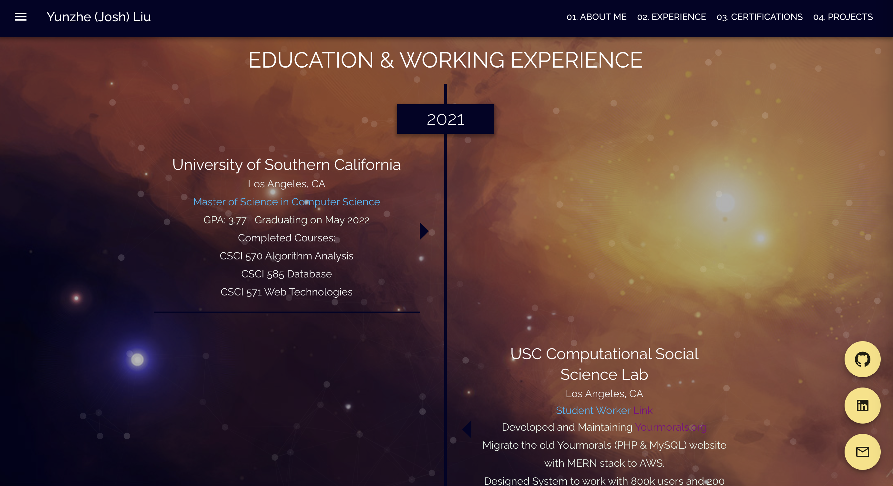
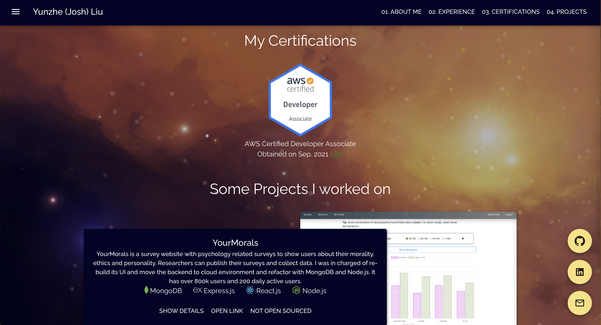
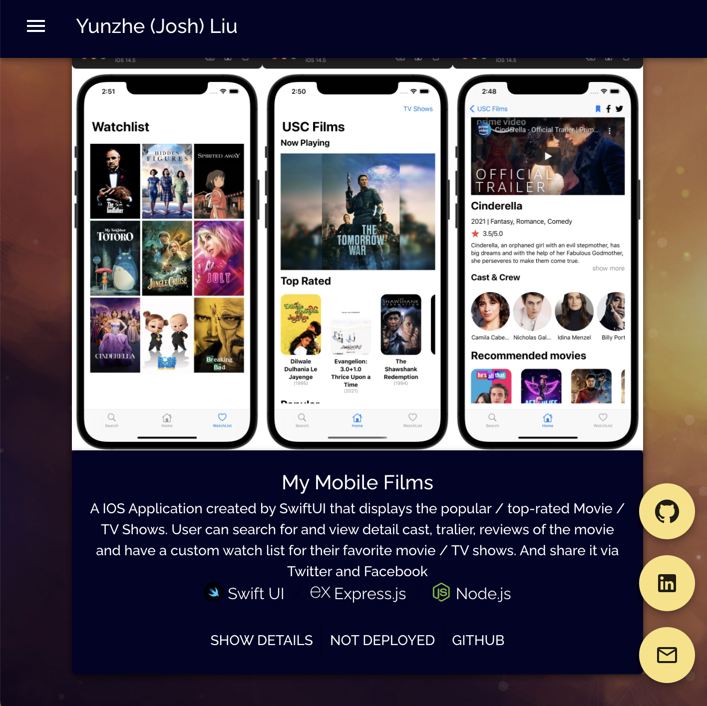

# [Josh's Portfolio](https://yunzheliu.net/)

Josh Liu's Portfolio created by React.js in TypeScript, used material ui, ts-particles. Responsive mobile-first PWA. Deployed on AWS S3, distributed by Cloudfront using cloudformation

## Table of contents

- [General info](#general-info)
- [Technologies](#technologies)
- [Screen Shots](#screenshots)
- [Setup](#setup)

## General info

1. Josh Liu's Portfolio with his resume

## Technologies

Project is created with:

- React/Typescript
- Material-ui
- AWS (S3, CloudFormation, Cloudfront)

## Screen Shots






## Setup

To run this project, install it locally using node:

```
$ yarn install
$ yarn start
```
